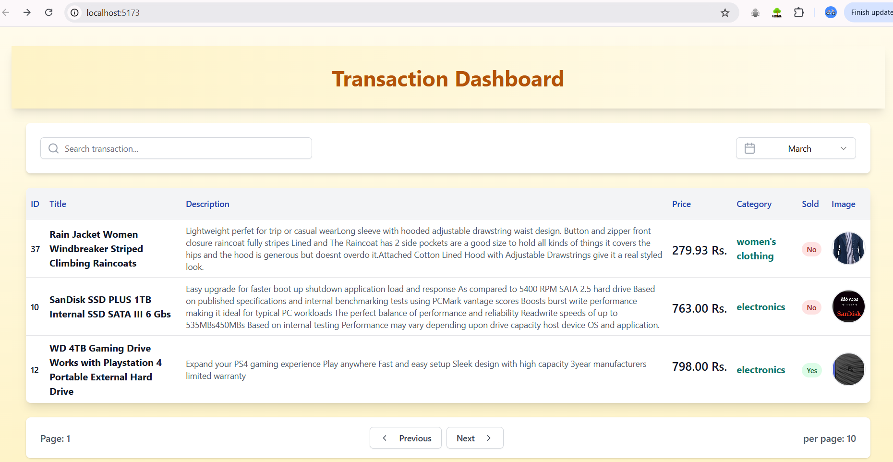
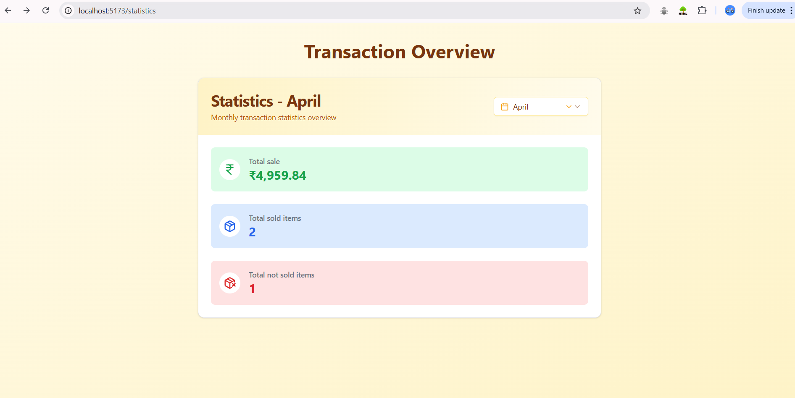
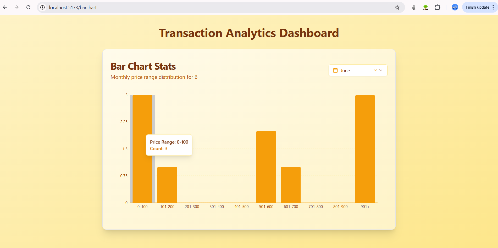

# MERN stack Challenge(Transaction Dashboard)

# Frontend look:

1. **Transaction Page**  
   

2. **Statistics Page**  
   

3. **Barchart Page**  
   

---


## Project Overview

This project is a full-stack application consisting of two parts:

1. **Backend**: Written using **Express.js** to handle API requests, interact with a **MongoDB** database, and provide data to the frontend.
2. **Frontend**: Written using **React** for the user interface.

---

## Installation

### 1. Clone the Repository

```bash
git clone https://github.com/abhishekmudhol/MERN_CHALLENGE.git
```


---